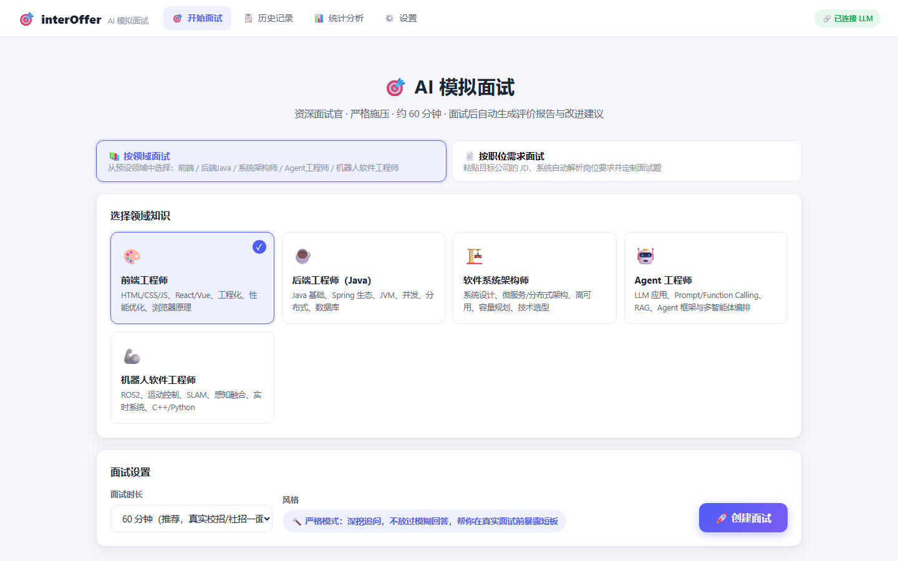
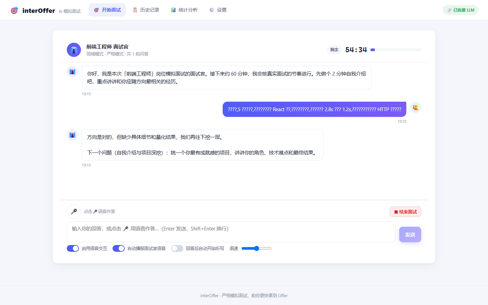
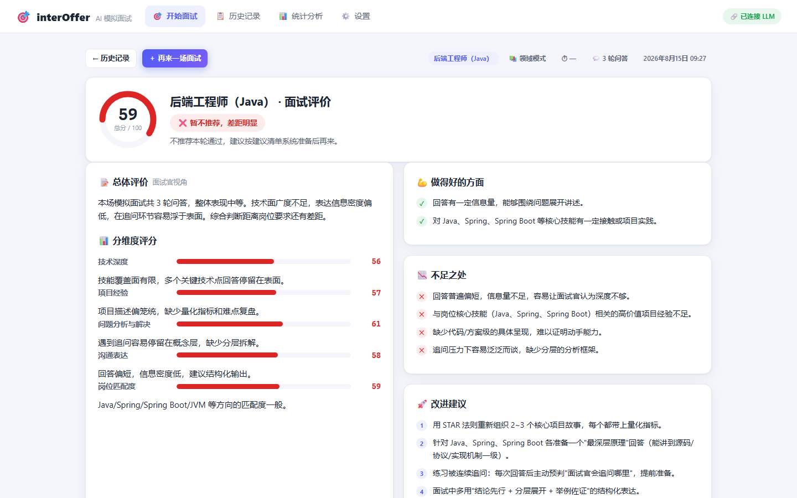
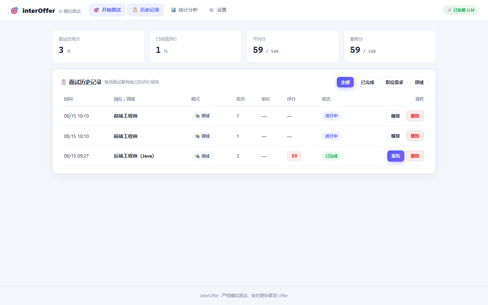
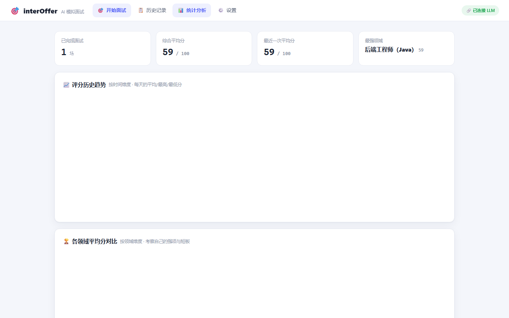

# 🎯 interOffer · AI 模拟面试系统

一个本地运行的 AI 模拟面试系统：以**严格面试官**的口吻，根据你粘贴的**职位需求（JD）**或选择的**领域知识**（前端 / 后端Java / 软件系统架构师 / Agent工程师 / 机器人软件工程师），发起一场约 1 小时的模拟面试，结束后自动生成**面试官视角的评价报告**（总分、分维度评分、优点、不足、改进建议），并提供**历史评价表**与**评分成长图表**（时间维度 + 领域维度）。支持**语音问答**（浏览器语音识别 + 语音播报）。

## 界面预览

| 首页 · 选择面试模式 | 面试房间 · 流式问答 + 语音 + 计时 |
| :---: | :---: |
|  |  |

| 评价报告 · 面试官视角 | 历史记录表 | 统计分析 · 成长曲线 |
| :---: | :---: | :---: |
|  |  |  |

## 功能一览

| 模块 | 说明 |
| --- | --- |
| 🎯 开始面试 | 两种模式：① 粘贴职位需求，自动解析岗位方向/核心技能并定制面试计划；② 选择预设领域（5 个） |
| 👔 面试房间 | 流式对话、60 分钟倒计时（可设 30~90 分钟）、严格追问、自动收尾 |
| 🎤 语音交互 | 点击麦克风语音作答（实时识别），面试官语音自动播报，可调语速 |
| 📝 评价报告 | 总分 + 6 维度评分 + 优点/不足/改进建议 + 面试全程记录，自动保存 |
| 📋 历史记录 | 每次面试一条记录（时间/岗位/轮次/时长/评分/状态），可查看报告或删除 |
| 📊 统计分析 | 评分随时间变化趋势、按领域平均分对比、能力维度雷达图 |
| ⚙️ 设置 | LLM 接口配置（任意 OpenAI 兼容服务）、默认时长；未配置 Key 时自动进入演示模式 |

## 快速开始

要求：**Node.js ≥ 22.5**（内置 SQLite，无需任何原生编译）。

```bash
# 1. 安装依赖
npm install

# 2. 构建前端
npm run build

# 3. 启动服务（默认端口 3210）
npm start
```

浏览器打开 **http://127.0.0.1:3210** 即可使用。

> 开发模式（前端热更新）：`npm run dev`，然后访问 http://127.0.0.1:3210。

### 配置真实 LLM（可选）

默认（未配置 API Key）使用内置 **Mock 面试官**，可离线体验完整流程。要获得更真实的面试体验，在「设置」页填写：

- **Base URL**：任意 OpenAI 兼容接口，例如
  - OpenAI：`https://api.openai.com/v1`
  - DeepSeek：`https://api.deepseek.com/v1`
  - 本地 Ollama：`http://localhost:11434/v1`
- **API Key**：对应服务的密钥（Ollama 可留空）
- **模型**：`gpt-4o-mini` / `deepseek-chat` / `qwen2.5:14b` 等

配置保存后立即生效，无需重启。也可直接编辑 `server/data/config.json`。

## 使用流程

1. **创建面试**：选择「按领域」或「按职位需求」；JD 模式会先展示解析出的面试计划（岗位、话题、代表性问题），确认后开始。
2. **进行面试**：面试官逐题提问，一次一个问题，回答浅薄会被连续追问深挖；右上角显示剩余时间，最后 5 分钟进入收尾环节；时间耗尽自动结束。
3. **结束面试**：点击「结束面试」→ 面试官根据完整对话记录生成评价报告。
4. **复盘提升**：在报告页查看总分、分维度得分、优缺点与可执行的改进建议；在「历史记录」回看每一场；在「统计分析」观察自己的成长曲线与强弱领域。

## 语音交互说明

- 使用浏览器 **Web Speech API**，建议用 **Chrome / Edge**（桌面版），无需任何额外服务或密钥。
- 面试房间内可开关：启用语音交互、自动播报面试官语音、回答后自动开始听写、语速调节。
- 点击 🎤 开始听写（中文），识别结果（含中间结果）自动填入输入框，可编辑后发送。
- 语音识别为本地浏览器能力，中文识别质量取决于浏览器与系统语音服务；不支持语音的浏览器会自动降级为纯文本输入。

## 技术架构

```
interOffer/
├── server/                 # Node.js + Express + node:sqlite
│   ├── index.js            # 服务入口（API + 静态资源 / Vite 开发中间件）
│   ├── routes.js           # API：会话/对话(SSE)/评价/统计/设置
│   ├── db.js               # SQLite 数据层（interviews / messages / settings）
│   ├── llm.js              # LLM 客户端（流式）+ 面试官/评价 prompts + Mock 实现
│   ├── prompts 内置        # JD 解析、严格面试官、评价生成
│   └── config.js           # LLM 与默认参数配置（data/config.json）
├── client/                 # Vite + React + ECharts 前端
│   └── src/
│       ├── views/          # 首页 / 面试房间 / 报告 / 历史 / 统计 / 设置
│       └── hooks/useSpeech.js   # 语音识别 + 语音合成
└── scripts/smoke.js        # 端到端冒烟测试（mock 模式）
```

### 面试引擎设计

- **JD 解析**：LLM 从职位需求中提取岗位、职级、核心技能，生成 6 类话题 × 若干问题的面试计划。
- **严格面试官**：系统提示词固定角色为"极其严格的资深面试官"，要求一次一问、回答浅薄必须连续追问 2~3 轮、按计划覆盖话题、按剩余时间切换节奏（正常推进 → 设计题/反问 → 收尾），每次回复前注入当前剩余时间。
- **评价生成**：结束面试时，LLM 基于完整对话记录 + 面试计划输出结构化 JSON（总分、5~7 个维度评分、优点、不足、改进建议、录用结论），解析后落库。
- **容错**：LLM 任何一步失败都会自动回退到 Mock 实现，保证流程永不中断。

### 数据存储

- `server/data/interviews.db`：SQLite（Node 内置 `node:sqlite`，零原生依赖），WAL 模式。
- `server/data/config.json`：LLM 配置与默认参数。
- 所有数据仅存本地。

## 冒烟测试

```bash
npm start            # 先启动服务
npm run smoke        # 走一遍 创建→开始→3轮对话→结束→评价→统计 全流程
```

## 常见问题

- **端口占用**：`PORT=3211 npm start` 自定义端口。
- **语音不可用**：请使用 Chrome/Edge；检查系统麦克风权限是否允许该站点。
- **想更快成长**：同一岗位多练几场，观察「统计分析」中评分与维度曲线的变化；报告中的"改进建议"按优先级逐条准备即可。
